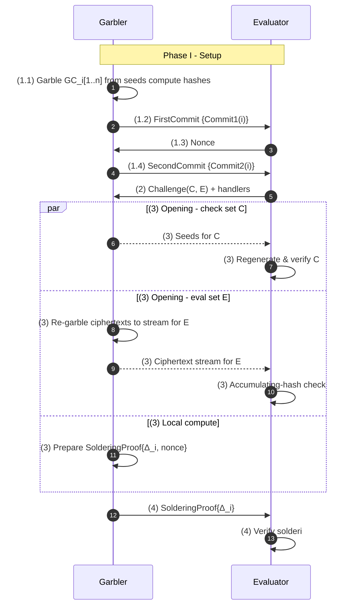
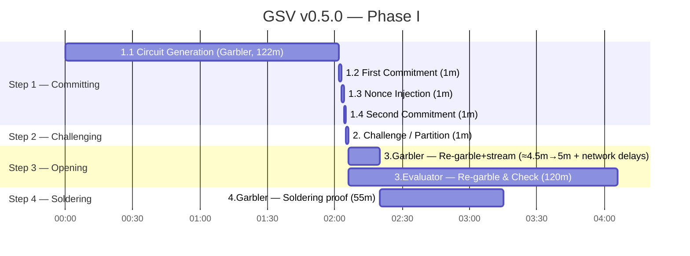

# Garbled Snark Verifier v0.5.0 Protocol

## 1. Overview

We specify a two‑party **Conditional Revealing Secret Scheme** parameterized by a fixed Groth16 relation.

**Public parameters:** security parameter `λ`; Groth16 verifying key `vk` for relation `R`.

**Setup(λ, R, vk, M_valid, M_invalid) → T.**
The parties precommit to `M_valid` and `M_invalid` and produce a transcript `T` that binds any subsequent release to this session.

**Evaluate(T, π) → {M_valid | M_invalid}.**
Given a proof `π`, compute `v := VerifyGroth16(vk, x, π)`. Output `M_valid` if `v = 1`, else `M_invalid`. It is computationally infeasible to obtain both messages or any information beyond the selected one.

**Realization note.**
`Setup` and `Evaluate` are implemented using a malicious‑secure garbled‑circuit protocol with cut‑and‑choose and an input‑consistency proof (“soldering”). These ensure that:  
(i) `π` is cryptographically linked to finalized instances and to the nonce‑hardened commitments in `T`;  
(ii) only the Garbler can produce a usable `π` within this session;  
(iii) any inconsistency aborts before release.

This design makes the release exclusively a function of `VerifyGroth16(vk, x, π)` while keeping garbling details as an implementation mechanism rather than the semantic core.

## 2. Protocol Parameters

- `n`: Total circuit instances 
- `f`: Instances to evaluate/finalize 
- `λ`: Computational security parameter (128 bits)

### Smallest $n$ s.t. probability < $2^{-40}$

| $f$ | n         |
| --: | --        |
| 2   | 1,482,911 |
| 3   | 18,756    |
| 4   | 2,268     |
| 5   | 669       |
| 6   | 307       |
| 7   | 181       |
| 8   | 124       |
| 9   | 95        |
| 10  | 78        |

We find it optimal to use $f == 7$, $n == 181$

### Cryptographic Primitives
- **Garbling scheme**: AES-based half-gates garbling
- **Ciphertext commitment**: AES-based accumulating hash
- **Label commitment**: SHA-256 hash function
- **Soldering proof**: SP1 zkVM with SHA-256 for connect input labels for $f$ instances

## 3. Setup and Evaluation

### Phase I: Setup

The setup phase covers all interactions before any circuit evaluation occurs. It fixes the garbler’s circuits/labels, runs cut-and-choose, checks opened instances, binds ciphertext streams for closed instances, and proves input consistency (soldering).

#### Step 1 – Committing

##### Step 1.1 – Circuit Generation
- Garbler generates `n` garbled circuits: for each `i ∈ [n]`, create `GC_i` from a random seed.

##### Step 1.2 – First Commitment
- For every instance `i`, the garbler sends:

```
Commit₁(i) = {
    ciphertext_hash: H(all_ciphertexts_i),
    input_commits: [(H(wire_j_label0), H(wire_j_label1))]_j,
    output_commit: (H(output_label0), H(output_label1)),
    constants: (true_wire_value, false_wire_value)
}
```

##### Step 1.3 – Nonce Injection
- Evaluator samples `nonce ∈ {0,1}^128` and sends it to the garbler. The nonce prevents second-preimage tricks on label commitments.

##### Step 1.4 – Second Commitment
- Garbler re-sends per-wire input commits with the nonce XORed into each label:

```
Commit₂(i) = {
    input_commits: [(H(wire_j_label0 XOR nonce), H(wire_j_label1 XOR nonce))]_j
}
```
- Note: the nonce is blended via bitwise XOR (not concatenation). Only input-label commits are re-hashed.

#### Step 2 – Challenging

- Evaluator randomly partitions `[n]` into a check set `C` (size `n-f`) and an evaluation set `E` (size `f`).
- Evaluator sends the indices in `E` together with ciphertext handlers to receive ciphertext streams for finalized instances.

#### Step 3 – Opening

- Garbler reveals seeds for every instance in `C`:
  ```
  OpenSeeds = {(index_i, seed_i) : i ∈ C}
  ```
- Evaluator regenerates each `GC_i` for `i ∈ C`, re-computes `Commit₁(i)` and `Commit₂(i)`, and checks equality with the received commitments.
- For each closed instance `i ∈ E`, the Garbler re‑garbles `GC_i` deterministically from its private seed and streams the resulting ciphertext blocks to Evaluator‑supplied handlers; the Evaluator recomputes the AES accumulating hash and verifies it matches `Commit₁(i).ciphertext_hash`. The ciphertext stream is transient and does not need to be persisted.
- Any mismatch (open or closed) aborts the protocol.

#### Step 4 – Soldering

- Let `b = min(E)` be the base evaluation instance. For every other `i ∈ E \ {b}`, compute per-wire deltas `Δ_i = input_labels_i ⊕ input_labels_b`.
- Garbler produces and sends an SP1-based `SolderingProof = ZKProve(base_labels_b, {Δ_i}, nonce)`.
- Evaluator verifies:
  - Base per-wire label commitments in the proof match `Commit₁(b)`.
  - Base per-wire label-with-nonce commitments match `Commit₂(b)`.
  - Each additional finalized instance’s per-wire commitments match `Commit₁(i)`.
  - Extracted deltas `{Δ_i}` are stored for deriving other finalized inputs.
- Any soldering verification failure aborts the protocol.

---

At this point, the gsv-v0.5.0 commitment can be considered created. It is possible to pre-sign any transactions, as well as onchain actions.

#### Overview


#### Timing


### Phase II: Evaluation

#### Step 1 – Publishing
- Garbler → Evaluator: Active input labels for base instance `b`
  ```
  BaseInput = {active_label_j : j ∈ input_wires}
  ```

- Notes: This action is expected to be performed as an onchain interaction. The correctness of the revealed labels and eventual proof is assumed rather than enforced here. The protocol expects the Garbler to provide the correct inputs (e.g. via an external hash-lock primitive during deployment) to trigger Phase II.

#### Step 2 – Unsoldering
- Evaluator does for each `i ∈ E \ {b}`:
  ```
  input_i = BaseInput ⊕ Δ_i
  ```
This is how Evaluator gets input labels for each of the $f$ instances

#### Step 3 – Evaluating
- For each `i ∈ E`:
  - Evaluate `GC_i` from saved ciphertexts

#### Step 4 – Revealing

- Evaluator evaluates each `GC_i`, obtaining the committed output label that encodes the verifier verdict bit `Verify(π)`.
- The label-to-bit mapping is fixed by `Commit₁(i).output_commit`, so matching labels across finalized instances affirms the conditional revealing secret scheme from the overview while the relation stays active.
- A shared verdict of `1` opens `M_valid`; a shared verdict of `0` opens `M_invalid`, ensuring exactly one precommitted message is released and binding the Garbler to the proof outcome captured in the transcript.

### Phase overview

- **Phase I**: Committing → Challenging → Opening → Soldering
- **Phase II**: Publishing → Unsoldering → Evaluating → Revealing

## 4. Message Summary

### Garbler → Evaluator

Setup:
1. **FirstCommits**: `{Commit₁(i)}_{i∈[n]}` - Circuit structure and label hashes
2. **SecondCommits**: `{Commit₂(i)}_{i∈[n]}` - Label hashes with nonce
3. **OpenSeeds**: `{(i, seed_i)}_{i∈C}` - Seeds for check set
4. **SolderingProof**: SP1 ZK proof + public values containing:
   - The proof itself
   - Deltas `{Δ_i}_{i∈E\{b}}` (per-wire XOR for label0/label1)
   - Base label commitments (per wire, label0/label1)
   - Base label-with-nonce commitments (per wire, label0/label1)
   - Per-instance label commitments for each additional finalized instance
Evaluation:
5. **BaseInput**: Active labels for base instance

### Evaluator → Garbler

Setup:
1. **Nonce**: Random 128-bit value for commitment freshness
2. **Challenge**: Evaluation set indices `E` with ciphertext handlers

## 5. Security Properties

### Commitment Binding
- **First commit**: Binds Garbler to specific circuit structure and wire labels
- **Second commit**: Adds Evaluator's randomness to prevent pre-computed collisions

### Cut-and-Choose Security

A malicious Garbler creating `k` incorrect circuits succeeds with probability at most `(f/n)^k` (parameters are configurable in implementations).

### Input Consistency via Soldering

All evaluated instances provably receive the same logical input, preventing selective failure attacks where different instances would fail on different inputs.

## 6. Abort Conditions

The protocol aborts if:
1. Regenerated circuits don't match commitments (Setup Step 3)
2. Soldering proof fails verification (Setup Step 4)
3. Evaluated circuits produce different outputs (Evaluation Step 4)
